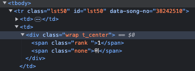

# 멜론 크롤링
## 가상환경
앞에서 환경 설정과 테스트를 마쳤으면 melon 크롤링은 아주 쉽다.

아래의 사진처럼 개발자 도구를 통해 원하는 데이터의 태그와 클래스 id 등을 파악한다.
이후 아래 설명의 기능들을 가지고 응용하면 된다.


- select는 해당하는 태그를 모두 찾아서 리스트로 변환해주는 역할을 한다.
- select_one은 해당하는 태그를 하나 찾아서 반환해주는 역할을 한다.
- .은 class 선택을 #은 id 선택을 의미한다.

아래의 예제와 주석을 보면 쉽게 이해할 수 있을 것이다.

```python
import requests
from bs4 import BeautifulSoup
from user_agent import generate_user_agent

def request_page_data(url: str, header: dict[str, str]):
    response = requests.get(url, headers=header, timeout=10)
    return BeautifulSoup(response.text, "html.parser")

if __name__ == '__main__':
    data = request_page_data(
        'https://www.melon.com/chart/index.htm',
        {
            "User-Agent": generate_user_agent(os="win", device_type="desktop"),
        }
    )
    # data는 BeautifulSoup 객체
    music_list = data.select("tr.lst50") # tr 태그 중 class가 lst50인 태그를 모두 찾아서 리스트로 반환
    for music in music_list:
        # class가 rank인 span 태그의 텍스트를 가져와서 int로 변환
        ranking = int(music.select_one("td > div > span.rank").text) 
        # class가 rank01인 span 태그의 텍스트를 가져옴
        title = music.select_one("td > div > div > div.ellipsis.rank01 > span > a").text.strip()
        # class가 rank02인 span 태그의 텍스트를 가져옴
        artist = music.select_one("td > div > div > div.ellipsis.rank02 > a").text.strip()
        # class가 rank03인 span 태그의 텍스트를 가져옴
        album = music.select_one("td > div > div > div.ellipsis.rank03 > a").text.strip()
        print(ranking, title, artist, album)
```
