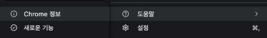
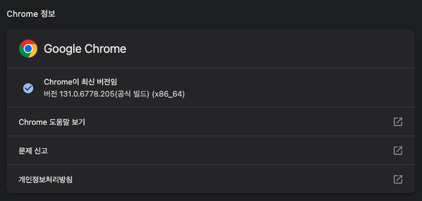
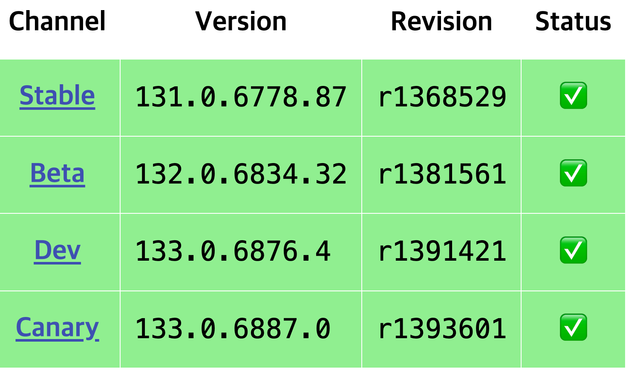
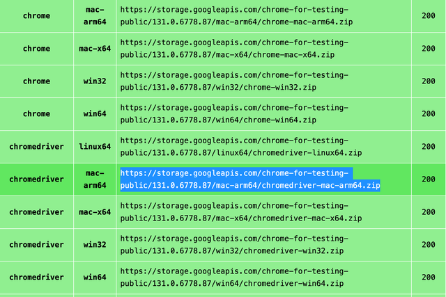

# Selenium
## 사용 이유
크롤링을 하다보면 requests만으로는 부족한 상황이 발생한다.
주로 JavaScript 렌더링 및 동적 웹사이트 처리가 필요한 페이지에서 사용되며, 브라우저의 WebDriver를 이용해 동작하기 때문에 실제 브라우저로 호출하는 것과 동일하게 동작한다.

## 환경설정 
여기서는 Chrome을 이용해서 진행을 할 것이며 크롬이 설치되어 있어야 한다.

크롬 브라우저의 오른쪽 상단 점 세개 → 도움말 → Chrome 정보에서 버전을 확인할 수 있다.




크롬 버전을 확인했으면 해당 버전에 맞는 웹 드라이버를 다운 받는다.

https://googlechromelabs.github.io/chrome-for-testing/

상단의 주소로 들어가서 운영체제에 맞는 원하는 드라이버를 다운 받는다.




다운로드 받은 파일의 압축을 풀고 작업하는 디렉토리로 옮긴다. 이 때 폴더 이름을 `chromedriver`로 수정하고 실행하는 파일과 같은 위치에 둔다.

모두 완료했다면 이제 다시 코드로 돌아와서 `pip install selenium`을 실행해 selenium을 설치한다.
그리고 아래와 같은 코드를 복사해서 main.py에 붙여 넣고 실행한다.

```python
import time

from bs4 import BeautifulSoup
from selenium import webdriver
from user_agent import generate_user_agent


def request_page_data(url: str, header: str):
    options = webdriver.ChromeOptions()
    options.add_argument("lang=ko_KR")
    options.add_argument("user-agent=" + header)
    options.add_argument("-private")
    # EC2에서 실행하기 위한 설정들
    options.add_argument("headless")
    options.add_argument("--no-sandbox")
    options.add_argument("--disable-logging")
    options.add_argument("disable-gpu")

    service = webdriver.ChromeService()
    service.path = "chromedriver/chromedriver"

    driver = webdriver.Chrome(service=service, options=options)
    driver.get(url)
    time.sleep(3)  # js 렌더링 시간 필요
    driver.implicitly_wait(10)

    response = driver.page_source
    driver.quit()
    return BeautifulSoup(response, "html.parser")

if __name__ == '__main__':
    data = request_page_data(
        'https://charts.youtube.com/charts/TrendingVideos/kr/RightNow',
        generate_user_agent(os="win", device_type="desktop")
    )
    print(data)

```

만약 local 실행시 'chromedriver'은(는) Apple에서 악성 소프트웨어가 있는지 확인할 수 없기 때문에 열 수 없습니다.
에러가 발샌한다면 chromedriver package 내부에서 `xattr -d com.apple.quarantine chromedriver` 명령어를 실행한다.

실행 후 홈페이지 데이터가 출력되면 끝 
